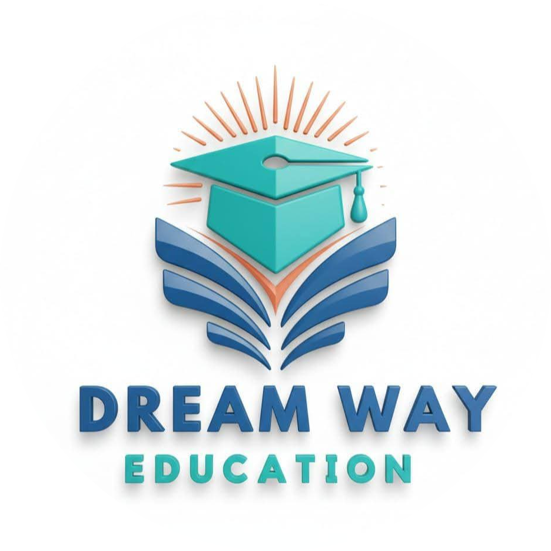

**`README.md`** ka code:

```md
<div align="center">



# Dreamway Education
### Pakistan's Premier Study Abroad Consultancy

[](https://react.dev/)
[](https://vitejs.dev/)
[](https://tailwindcss.com/)
[](https://www.framer.com/motion/)

</div>

---

## 🌍 Overview

**Dreamway Education** is a fully responsive, modern website for a professional study abroad consultancy based in Lahore, Pakistan. The platform helps Pakistani students discover universities, explore study destinations, and book free consultations — all through a premium, SaaS-level web experience.

> Designed and developed to be several times more modern than typical Pakistani consultancy websites — inspired by the aesthetics of world-class SaaS and fintech products.

---

## ✨ Features

- 🎨 **Premium UI/UX** — Custom brand identity with Teal + Deep Blue color palette
- 🌐 **15 Study Destinations** — Detailed country pages with universities, programs & requirements
- 📱 **Fully Responsive** — Mobile, tablet, and desktop optimized
- ⚡ **Smooth Animations** — Framer Motion powered page transitions and scroll animations
- 🔢 **Animated Counters** — Stats that count up on scroll
- 🎠 **Custom Carousel** — Embla Carousel powered testimonials slider
- 🧱 **Masonry Grid** — Dynamic testimonials page layout
- 🔍 **SEO Optimized** — Full meta tags, Open Graph, Twitter Cards & Schema.org structured data
- 📬 **Contact Form** — With WhatsApp integration, Google Maps embed & office hours
- 🗺️ **Multi-page Routing** — React Router v6 with scroll-to-top on navigation
- 🌙 **Glassmorphism Navbar** — Sticky glassy navbar with mobile hamburger menu
- 404 **Custom Not Found Page** — Branded 404 experience

---

## 🗂️ Project Structure

```
dreamway-education/
├── public/
│   └── fav_icon.png
├── src/
│   ├── components/
│   │   ├── Navbar.jsx          # Glassy sticky navbar
│   │   ├── Footer.jsx          # Dark footer with links & socials
│   │   ├── ScrollToTop.jsx     # Auto scroll on route change
│   │   ├── Home.jsx            # Full homepage
│   │   ├── Countries.jsx       # All 15 countries listing
│   │   ├── CountryDetail.jsx   # Individual country detail pages
│   │   ├── About.jsx           # About the consultancy
│   │   ├── Testimonials.jsx    # Masonry testimonials grid
│   │   ├── Contact.jsx         # Contact form + map + socials
│   │   └── NotFound.jsx        # Custom 404 page
│   ├── App.jsx                 # Routing setup
│   ├── main.jsx                # App entry point
│   └── index.css               # Global styles + Tailwind theme
├── index.html                  # SEO optimized HTML
├── vite.config.js
└── package.json
```

---

## 🎨 Brand Identity

| Role | Color | Hex | Usage |
|------|-------|-----|-------|
| Primary | 🟦 Teal | `#23AAA6` | Buttons, links, highlights — 60% |
| Secondary | 🔵 Deep Blue | `#265D96` | Gradients, icons, accents — 30% |
| Accent | 🟧 Terracotta | `#C97E5E` | Badges, stars, rare CTAs — <10% |

**Typography**
- Display: `Fraunces` (serif) — headings
- Body: `Plus Jakarta Sans` (sans-serif) — all UI text

---

## 📄 Pages

| Page | Route | Description |
|------|-------|-------------|
| Home | `/` | Hero, Stats, Services, Countries, Process, Why Us, Testimonials, FAQ, CTA |
| Countries | `/countries` | All 15 destinations with region filter |
| Country Detail | `/countries/:slug` | Per-country info, universities, programs, requirements |
| About | `/about` | Mission, values, timeline, team |
| Testimonials | `/testimonials` | Masonry grid with country filter |
| Contact | `/contact` | Form, WhatsApp, map, office hours, socials |
| 404 | `*` | Custom not found page |

---

## 🚀 Getting Started

### Prerequisites

- Node.js `v18+`
- npm or yarn

### Installation

```bash
# Clone the repository
git clone https://github.com/ali-developer/dreamway-education.git

# Navigate into the project
cd dreamway-education

# Install dependencies
npm install

# Start development server
npm run dev
```

### Build for Production

```bash
npm run build
```

### Preview Production Build

```bash
npm run preview
```

---

## 📦 Dependencies

| Package | Version | Purpose |
|---------|---------|---------|
| `react` | ^19 | UI framework |
| `react-dom` | ^19 | DOM rendering |
| `react-router-dom` | ^6 | Client-side routing |
| `framer-motion` | latest | Animations & transitions |
| `embla-carousel-react` | latest | Testimonials carousel |
| `react-icons` | latest | Icon library |
| `tailwindcss` | v4 | Utility-first CSS |

---

## 🌐 Study Destinations

| Country | Region | Highlight |
|---------|--------|-----------|
| 🇲🇾 Malaysia | Asia | Affordable & English Medium |
| 🇨🇾 Cyprus | Europe | EU Recognized Degree |
| 🇬🇧 United Kingdom | Europe | World Ranked Universities |
| 🇹🇷 Turkey | Asia | Generous Scholarships |
| 🇱🇹 Lithuania | Europe | Affordable EU Education |
| 🇱🇻 Latvia | Europe | EU Programs & Schengen |
| 🇦🇺 Australia | Pacific | Top Ranked & Work Rights |
| 🇳🇿 New Zealand | Pacific | Safe & Quality of Life |
| 🇨🇦 Canada | Americas | PR Pathway |
| 🇺🇸 USA | Americas | Ivy League & Research |
| 🇩🇪 Germany | Europe | Free / Low Tuition |
| 🇫🇷 France | Europe | Prestige & Culture |
| 🇳🇱 Netherlands | Europe | English Taught & Innovation |
| 🇵🇱 Poland | Europe | Affordable EU & Schengen |
| 🇭🇺 Hungary | Europe | EU Degree & Scholarships |

---

## 🙌 Author

**Ali** — Developer

> Built with ❤️ for Dreamway Education, Lahore, Pakistan.

---

## 📄 License

This project is private and proprietary.  
© 2024 Dreamway Education. All rights reserved.
```